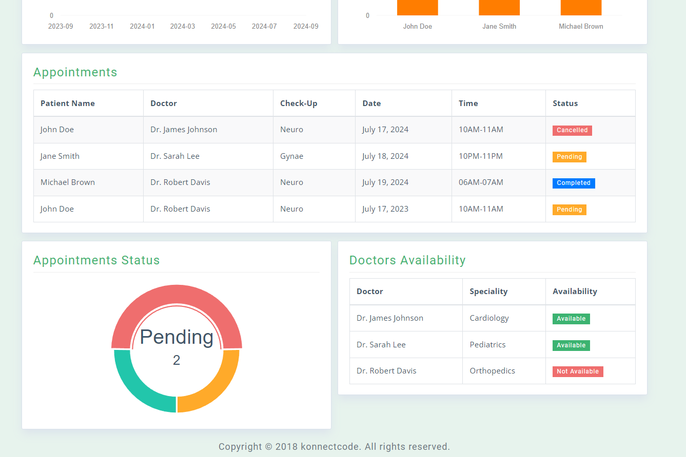
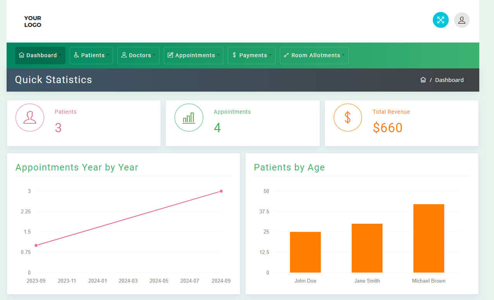

# Hospital Management System

## Overview
The Hospital Management System is a web application developed using Django Rest Framework for backend API services, Bootstrap for frontend design, and Morris charts for data visualization. It provides comprehensive functionality for managing hospital operations, patient records, and administrative tasks.

## Features
- **Patient Management:** Register, update, and view patient details including medical history and treatment records.
- **Appointment Scheduling:** Manage appointments between doctors and patients, ensuring efficient use of healthcare resources.
- **Staff Management:** Maintain records of hospital staff including doctors, nurses, and administrative personnel.
- **Medical Records:** Digitize and store medical records securely, accessible to authorized healthcare providers.
- **Data Visualization:** Utilize Morris charts to visualize hospital data such as patient demographics, appointment statistics, and medical trends.

## Technologies Used
- **Backend:** Django Rest Framework, Python
- **Frontend:** HTML, CSS (Bootstrap)
- **Data Visualization:** Morris charts
- **Database:** SQLite (can be extended to other databases supported by Django)
- **Deployment:** Django's built-in development server (can be deployed on platforms like AWS, Heroku, etc.)

## Setup Instructions
1. **Install Python:**
   Make sure Python is installed on your system. You can download it from [python.org](https://www.python.org/downloads/) and follow the installation instructions.

2. **Create a Virtual Environment:**
   It's recommended to use a virtual environment to manage dependencies for your Django project.
   
   ```bash
   # Install virtualenv if you haven't already
   pip install virtualenv
   
   # Create a virtual environment
   virtualenv venv
   
   # Activate the virtual environment (on Windows)
   venv\Scripts\activate
   
   # Activate the virtual environment (on macOS/Linux)
   source venv/bin/activate

 3. **Install Django and Django Rest Framework:**
```bash
   # Install Django and Django Rest Framework using pip.
    pip install django djangorestframework
```
4. **Clone and Setup Your Project:**
```bash
   # git clone https://github.com/hadithedetonator/django-rest-hms
   cd django-rest-hms
```
5. **Create a Superuser**
```bash
python manage.py createsuperuser
```
6. **Run the Development Server**
   ```bash
   python manage.py runserver
   ```


